# Rīki-noma (Instrumentu nomas sistēma)

Vietne, kurā viesi var apskatīt instrumentu katalogu, lietotāji rezervēt aprīkojumu
ar datumu pārbaudi, bet administrators pārvaldīt visu inventāru.

## Komandas dalībnieki un lomas

| Vārds | Loma |
|---|---|
| Rolands | Vadītājs (Trello/GitHub organizācija, dokumentācija, prezentācijas, testēšanas koordinācija) |
| Marija | Programmētāja (backend, datubāze, API, testēšana) |
| Ksenija | Dizainere (UI/UX skices, vizuālais stils, frontend, testēšana) |

Lomas ir universālas – visi var strādāt jebkurā uzdevumā. Ievērojam paritātes
principu: neviens neveic vairāk par 50% no visa koda.

## Metodoloģija

Agile ar Kanban metodi. Trello dēlis ar kolonnām Backlog / To Do / In Progress /
Review / Done, WIP limits – max 2 kartītes "In Progress" uz cilvēku; katrai
kartītei – apraksts, izpildes kritēriji, atbildīgais un termiņš. Izstrāde notiek
feature zaros, katrs Pull Request saistīts ar Trello karti un apstiprināts no
cita dalībnieka.

## Izstrādes plāns

- [x] Fāze 1 – grupas organizēšana, tēmas izpēte, tehnoloģiju izvēle, GitHub + Trello bāze
- [x] Fāze 2 – Use Case diagramma, arhitektūra, ER diagramma, 8 saskarnes skices, uzdevumu plānošana Trello
- [x] Fāze 3 – realizācija (Sprinti 1–5: DB + autentifikācija → rīku CRUD → rezervēšana → admin panelis → UI/UX)
- [ ] Fāze 4 – testēšana (plāns, izpilde, kļūdu novēršana, atskaite)
- [ ] Fāze 5 – prezentācija (lietotāja instrukcija, demonstrācija)

## Galvenās funkcionalitātes

- Rīku katalogs ar meklēšanu un filtrēšanu (viesis/lietotājs/admin)
- Rezervēšana ar datumu atlasi un pieejamības pārbaudi (lietotājs)
- Pilna CRUD funkcionalitāte rīku pārvaldībai (administrators)
- Reģistrācija, autentifikācija, profila informācijas un paroles maiņa
- Obligāta lietošanas noteikumu piekrišana rezervējot; piekrišana tiek piesaistīta pasūtījumam
- Instrumentu vērtējumi un atsauksmes pēc pabeigtas nomas
- Apstiprinājuma un kļūdas paziņojumi, dzēšanas apstiprinājuma modāļi
- Administratora panelis ar inventāra un pasūtījumu pārvaldību, lietotāju meklēšanu un lomu maiņu
- Responsīvs dizains

**Lomas:** Viesis – skata katalogu, meklē, filtrē. Lietotājs – + rezervē, apskata
vēsturi, atceļ. Klients pēc pabeigtas nomas var novērtēt iznomāto rīku.
Administrators – pilna piekļuve: CRUD, rezervāciju un lietotāju pārvaldība
(tostarp piekļuves līmeņi), statistika. Jauns rezervācijas pieprasījums gaida
administratora apstiprinājumu; lietotājs redz tā statusu savā kontā.

## Tēmas izpēte un pamatojums

Digitalizācija mazajos uzņēmumos, "nomaišana pret pirkšanu" un elastīga īstermiņa
aprīkojuma piekļuve padara šo tēmu aktuālu.

| Risinājums | Cena | Stiprās puses | Vājās puses |
|---|---|---|---|
| Booqable | no $29/mēn | Viegli lietojams | Ierobežots lieliem parkiem |
| EZRentOut | no $59/mēn | Svītrkodi, mobilā lietotne | Dārgs lielām datubāzēm |
| Point of Rental | pēc pieprasījuma | 40+ gadu pieredze | Ilga ieviešana, dārgs |
| HireHop | bezmaksas/£25 | Lēts | Lielbritānijas tirgus |
| Quipli | no $99/mēn | Moderns | ASV orientēts, bez API |

**Mūsu niša:** mazie Latvijas nomas punkti, skolu maker-space, individuāli meistari.

## Unikalitāte salīdzinājumā ar konkurentiem

1. **Reāllaika pieejamības kalendārs** – aizņemtie datumi vizuāli bloķēti jau
   rezervācijas formā, nevis kļūdas paziņojums pēc iesniegšanas.
2. **Datu piederība** – sistēma darbojas pašu serverī (self-hosted), dati netiek
   glabāti svešos komercserveros, atbilst GDPR.
3. **Bez ierobežojuma inventāra apjomam** – nav jāmaksā par katru papildu
   instrumentu vai datubāzes izmēru, kā SaaS risinājumos.
4. **Latviska saskarne un lokālie formāti** – DD.MM.YYYY un € formāti, neviena
   no izpētītajām platformām nav latviskota.
5. **Ātra darba plūsma** – rezervācija 3 klikšķos; nav vajadzīgas apmācības.
6. **Pilnvērtīga mobila pārvaldība** – viss admina CRUD strādā no telefona.

## Tehnoloģiju izvēle

| Slānis | Tehnoloģija | Pamatojums |
|---|---|---|
| Backend | PHP 8.2 + Laravel 11 | Visplašāk izmantotais PHP ietvars; iebūvēti migrācijas, validācija, maršrutēšana; liela kopiena |
| Autentifikācija | Laravel Sanctum | Gatava API token autentifikācija SPA lietotnēm |
| Datubāze | MySQL 8 | Laravel standarta DB; droši transakciju dati |
| ORM | Eloquent | Iebūvēts Laravel – nav atsevišķa rīka vajadzības |
| Frontend | React 18 + Vite (JavaScript) | Komponentu bāzēts, ātrs, ērts responsīvam dizainam |
| Stils | Tailwind CSS | Ātrs un konsekvents stilizējums |

Prasība par divām dažādām programmēšanas tehnoloģijām tiek nodrošināta ar
**PHP (backend) + JavaScript (frontend)**. Apsvērtas alternatīvas: Python FastAPI
un Node.js/Express – tās atmestas, jo Laravel ir ieteiktais steks kursā un
apvieno visu nepieciešamo vienā ietvarā.

## Plānotā repozitorija struktūra

> Šī ir mērķa struktūra, ko izveidosim Fāzes 3 sprintos. Kartīte
> DEV-01 (Sprint 1) paredz Laravel un React projektu skeletu ievietošanu šajās mapēs.

```
riki-noma/
├── README.md
├── .gitignore
├── backend/            # Laravel API
│   ├── app/
│   │   ├── Models/         # Eloquent modeļi
│   │   ├── Http/Controllers/
│   │   ├── Http/Requests/  # Formu validācija
│   │   └── Policies/
│   ├── database/migrations/
│   ├── routes/api.php
│   └── tests/
├── frontend/           # React + Vite
│   ├── src/
│   │   ├── components/
│   │   ├── pages/
│   │   ├── services/     # API izsaukumi (axios)
│   │   └── context/
│   └── package.json
└── docs/               # Diagrammas, skices, instrukcijas
```


### PR apstiprināšanas process

Izmantojam zarus `feature/TRELLO-ID-nosaukums` un
commit formātu latviešu valodā `[TRELLO-ID] Darbības Vārds: apraksts`.

Katrs uzdevums sākas ar jaunu zaru no `main`, nekad nepievienojam izmaiņas
tieši `main`. Kad zars ir gatavs, izveidojam Pull Request (PR). Kamēr PR
gaida apstiprinājumu, tas paliek atsevišķā zarā un nemaina `main`.

Citi var droši strādāt savos zaros, jo katrs zars iziet no tā brīža `main`.
Pirms jauna uzdevuma vienmēr izpildām `git pull origin main`, lai strādātu
ar jaunāko kodu. Ja kāda cita PR tiek apstiprināta ātrāk, tās izmaiņas
parādās `main` un mēs tās saņemam ar nākamo `pull`.

## Uzstādīšana un palaišana

**Priekšnosacījumi:** PHP 8.2+, Composer, Node.js 18+, MySQL 8+, Git.

```bash
# Backend (Laravel API)
cd backend
composer install
cp .env.example .env
php artisan key:generate
# .env iestatīt: DB_DATABASE=riki_noma, DB_USERNAME=..., DB_PASSWORD=...
php artisan migrate          # izveido tabulas
php artisan db:seed          # sākuma lomas, konti, kategorijas un inventārs
php artisan storage:link     # publiska piekļuve augšupielādētajiem attēliem
php artisan serve            # API: http://localhost:8000

# Frontend (React)
cd frontend
npm install
npm run dev                  # Lietotne: http://localhost:5173
```

Sēklas datus pievieno tikai jaunai, tikko migrētai datubāzei. Tie paredzēti lokālai izstrādei un demonstrācijai; pirms publiskas izvietošanas nomaini sākotnējo kontu paroles.

## Testēšanas pierādījumi

Klikšķini uz attēla, lai to atvērtu lielākā izmērā.

| Pārbaude | Attēls |
|---|---|
| UI-01 sākumlapa | [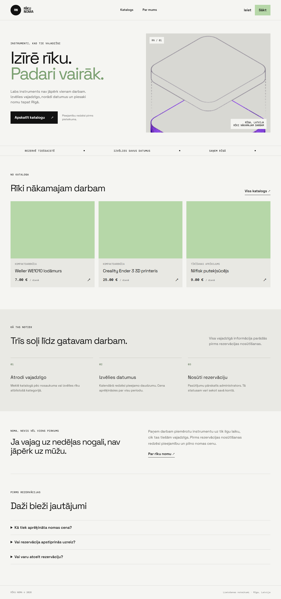](docs/tests/screen/UI-01.png) |
| UI-02 katalogs | [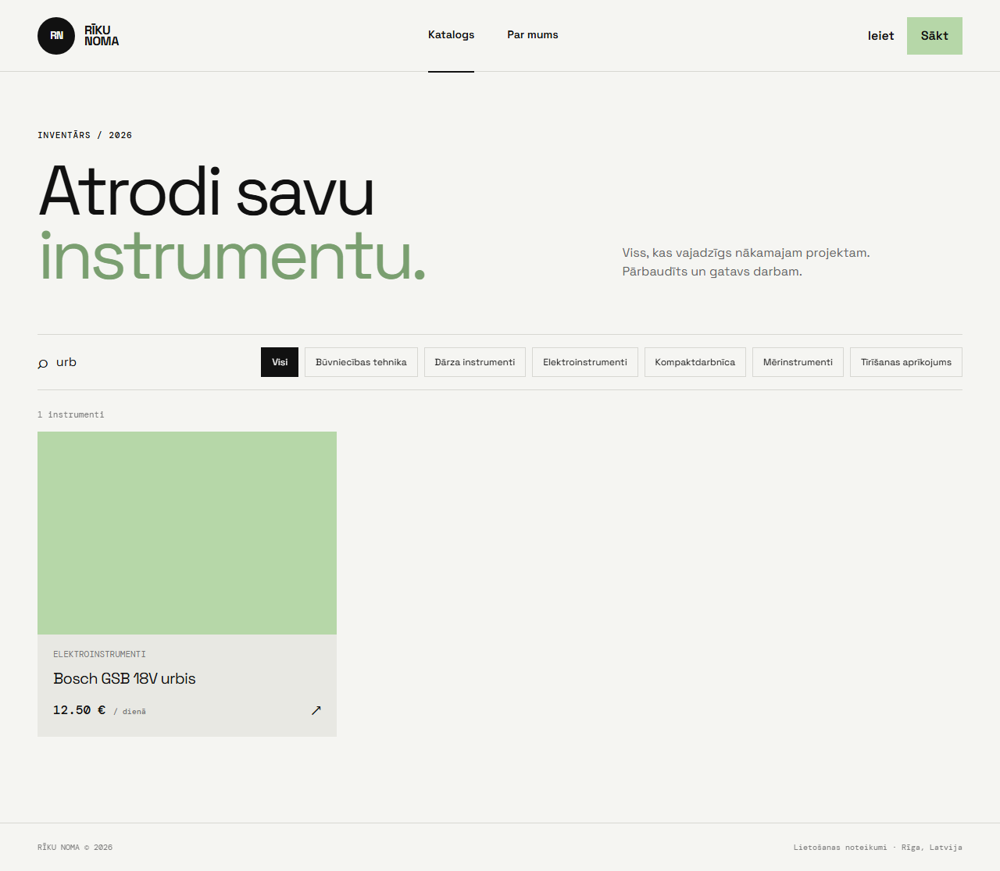](docs/tests/screen/UI-02.png) |
| UI-03 rīka detaļas | [](docs/tests/screen/UI-03.png) |
| UI-04 formas | [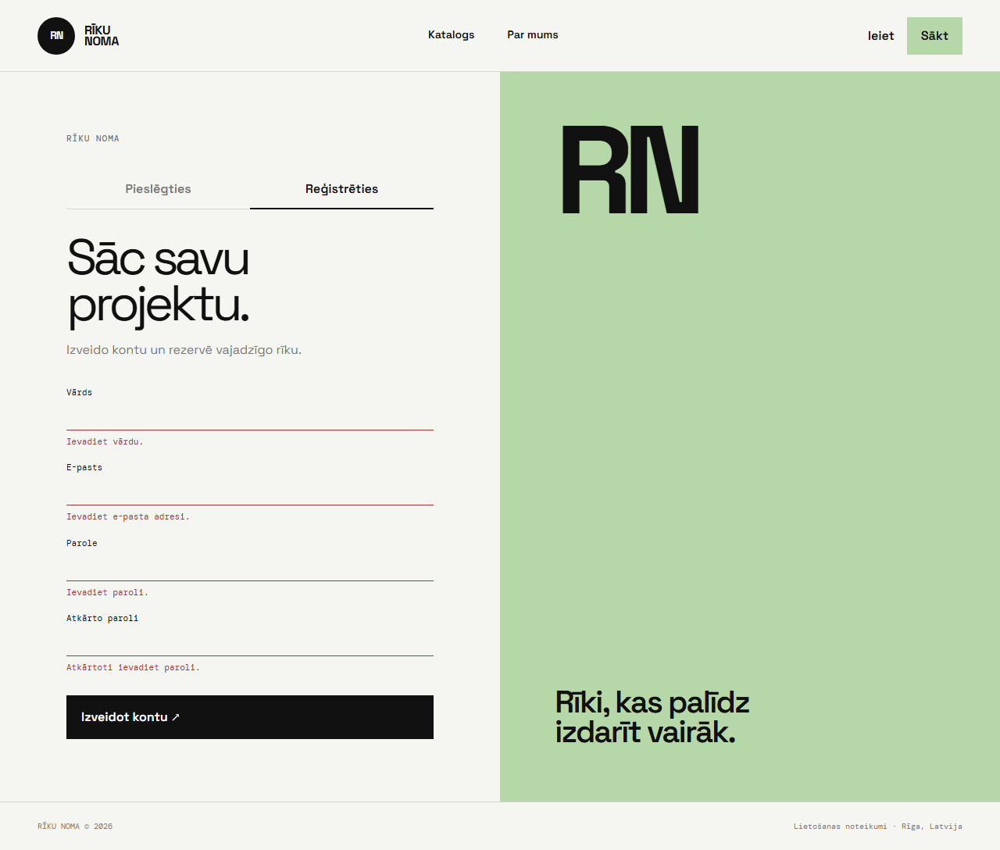](docs/tests/screen/UI-04.png) |
| UI-05 pasūtījumi | [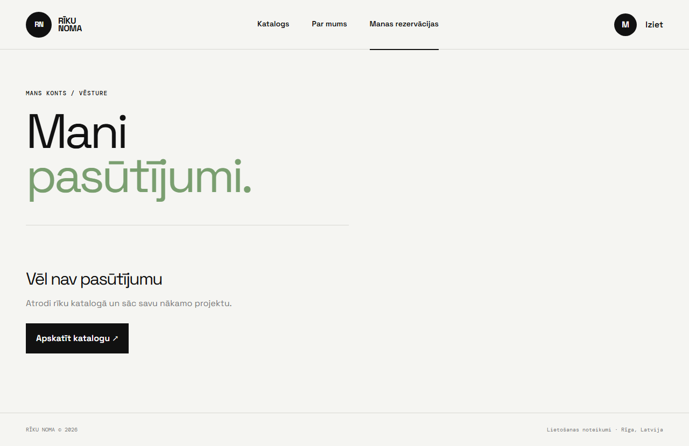](docs/tests/screen/UI-05.png) |
| UI-06 profils | [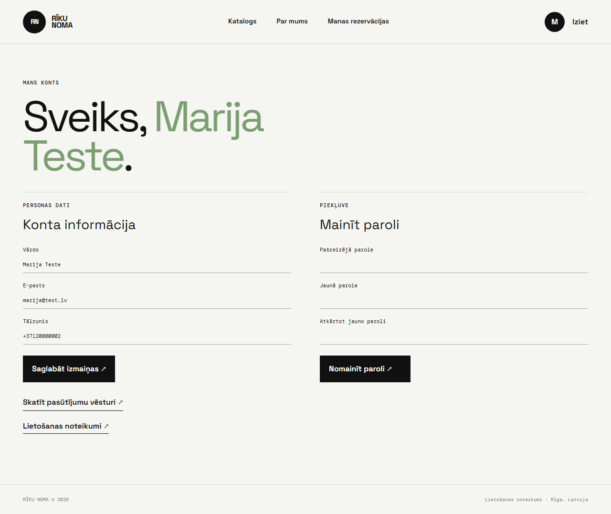](docs/tests/screen/UI-06.png) |
| FT-02 admina panelis | [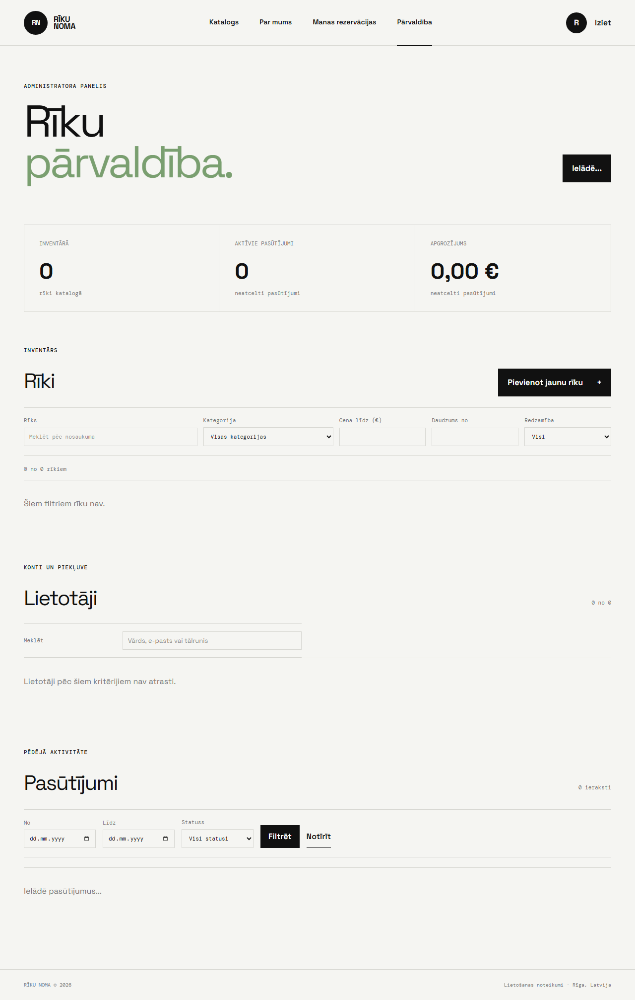](docs/tests/screen/FT-02.png) |
| UI-08 noteikumi | [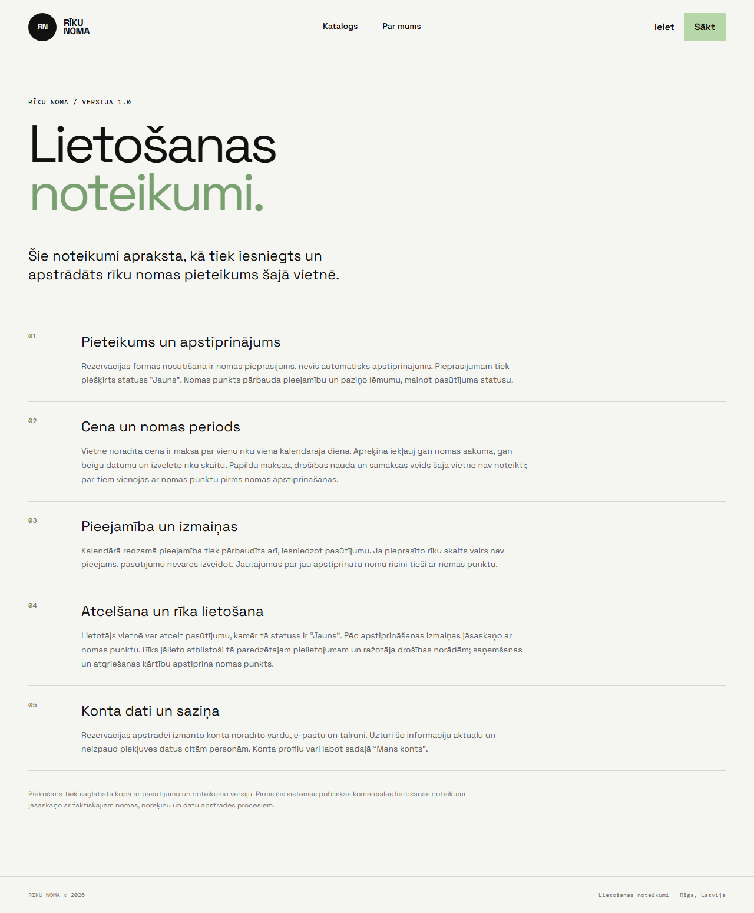](docs/tests/screen/UI-08.png) |
| UI-09 mobilais skats | [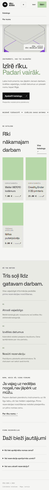](docs/tests/screen/UI-09-MOB.png) |
| BV-01 parole | [](docs/tests/screen/BV-01.png) |
| BV-02 parole | [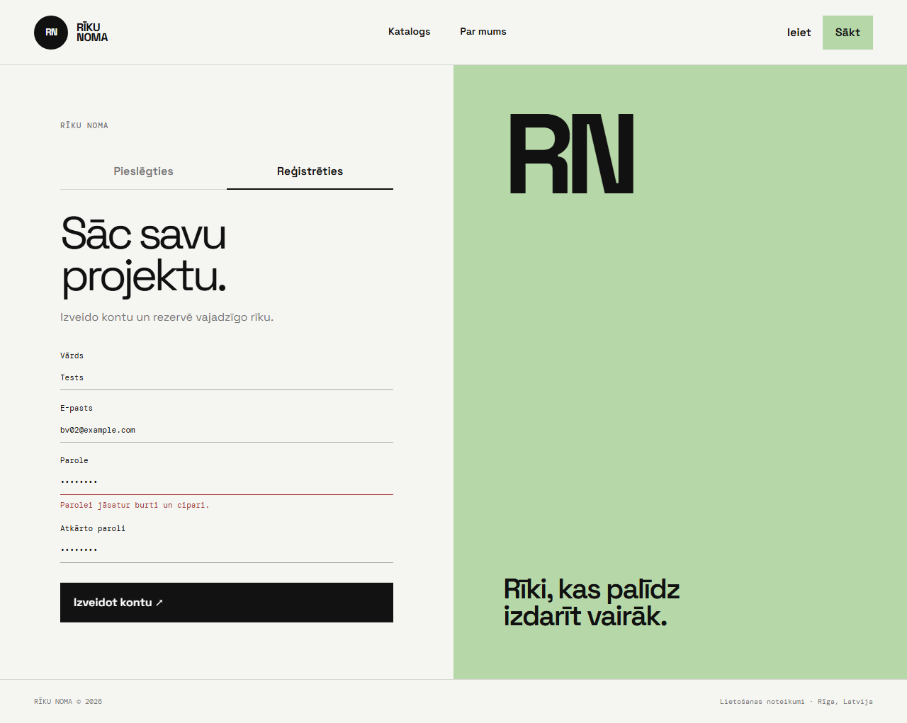](docs/tests/screen/BV-02.png) |
| BV-03 cena | [](docs/tests/screen/BV-03.png) |
| BV-04 daudzums | [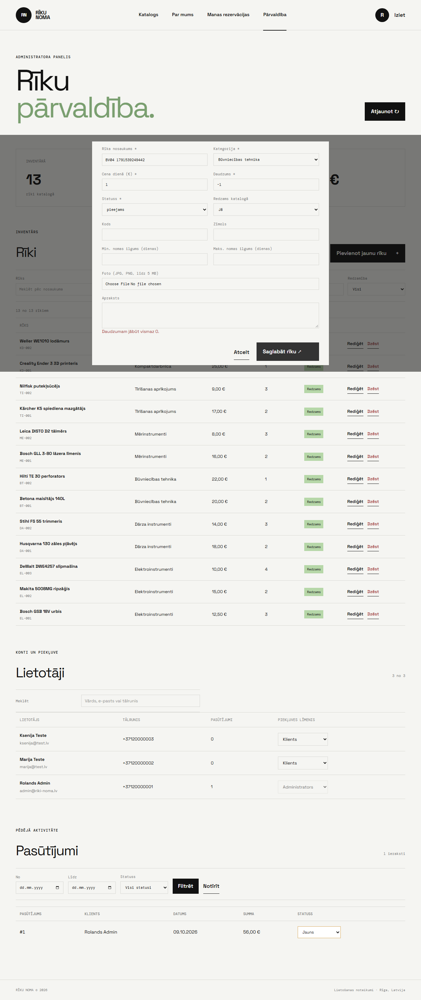](docs/tests/screen/BV-04.png) |
| BV-05 pagātnes datums | [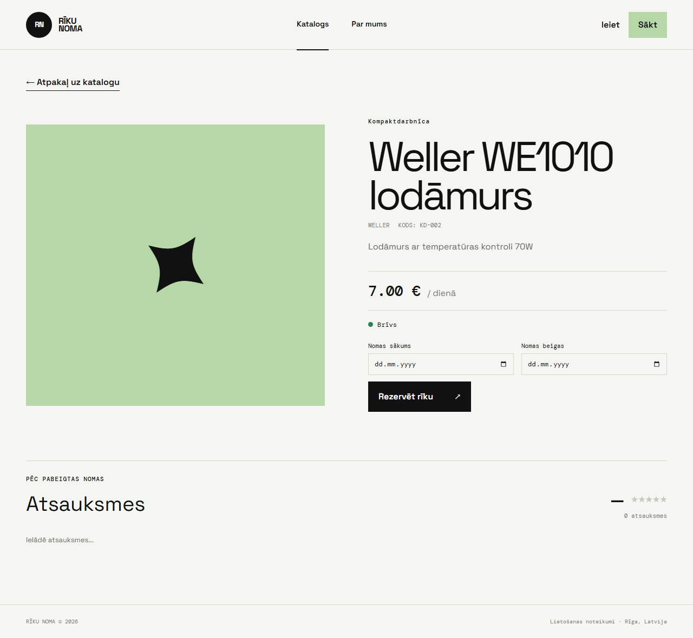](docs/tests/screen/BV-05.png) |
| BV-06 datumi | [](docs/tests/screen/BV-06.png) |
| ER-01 dublēts e-pasts | [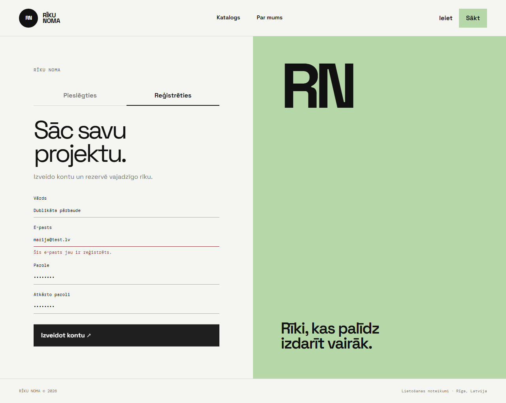](docs/tests/screen/ER-01.png) |
| ER-02 klienta piekļuve | [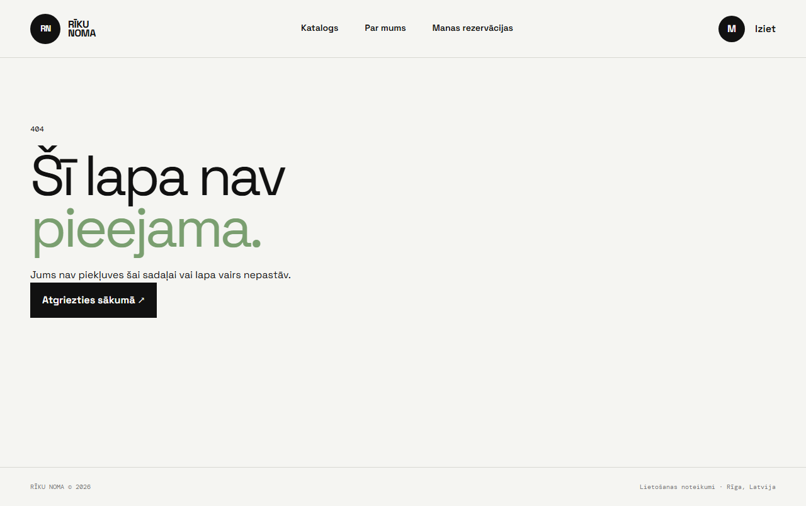](docs/tests/screen/ER-02.png) |
| ER-03 aizņemts rīks | [](docs/tests/screen/ER-03.png) |
| ER-04 aizsargāta lapa | [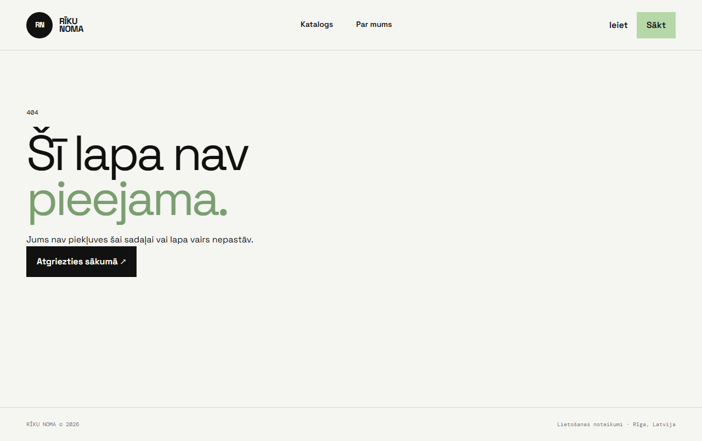](docs/tests/screen/ER-04.png) |

Pilna tabula ar tekstiem, testētājiem un datumiem ir [UI rezultātos](docs/tests/screen/ui-results.md).
